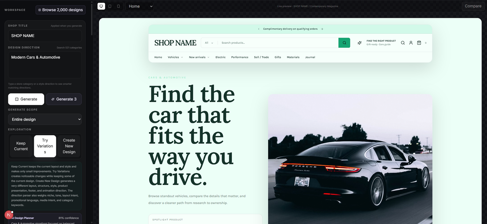
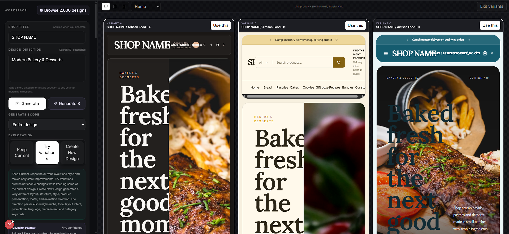

<h1 align="center">Shopify UI Generator</h1>

<p align="center">
  Generate, compare, refine, and export responsive ecommerce storefront concepts from a category or design direction.
</p>

<p align="center">
  
  
  
  
  
</p>

Shopify UI Generator is an open-source storefront design workspace built with Next.js, React, TypeScript, Tailwind CSS, and Motion. It combines reusable composition systems for headers, heroes, product sections, typography, media, interactions, motion, and responsive behavior instead of relying on one fixed template.

> **Trademark notice:** Shopify UI Generator is an independent project and is not affiliated with, endorsed by, or sponsored by Shopify Inc. Shopify is a trademark of Shopify Inc.

## Preview

### Storefront generation

<p align="center">
  
</p>

Generate a complete storefront from a design direction, then inspect it directly in the live responsive preview.

### Generate 3 variations

<p align="center">
  
</p>

Explore three structurally different storefront directions side by side and choose the one you want to continue refining.

## Highlights

| Area | What it does |
| --- | --- |
| **Design generation** | Creates storefront concepts from a short category, niche, or design direction. |
| **Variation explorer** | Keeps the current design, tries related variations, or creates a new design direction. |
| **Generate 3** | Produces multiple visual directions at once for faster comparison. |
| **Responsive preview** | Reviews storefronts across desktop, tablet, and mobile views. |
| **Section control** | Regenerates individual sections while preserving parts you want to keep. |
| **Storefront pages** | Supports product, collection, cart, search, and content-oriented page foundations. |
| **Motion and interaction** | Uses Motion-based interaction patterns and responsive UI behavior. |
| **Export foundation** | Provides React and Shopify OS 2.0-oriented export foundations for implementation workflows. |

## Features

- Generate storefront concepts from a short design direction or product niche
- Browse a large catalog of curated ecommerce design directions and categories
- Produce different header, hero, collection, product, pricing, section, and footer compositions
- Compare multiple generated storefront variations before choosing a direction
- Preview layouts on desktop, tablet, and mobile
- Regenerate individual sections while preserving locked parts of a design
- Edit copy, styling, sections, interactions, and responsive behavior
- Work with multiple storefront pages instead of a single landing page
- Use local generation without an API key, with an optional OpenAI planning route
- Export foundations for React and Shopify OS 2.0 workflows

## Tech Stack

| Technology | Role |
| --- | --- |
| [Next.js](https://nextjs.org/) 16 | Application framework |
| [React](https://react.dev/) 19 | UI rendering |
| [TypeScript](https://www.typescriptlang.org/) | Type-safe application code |
| [Tailwind CSS](https://tailwindcss.com/) 4 | Styling and responsive layout |
| [Motion](https://motion.dev/) | Motion and interaction system |
| [Zustand](https://zustand.docs.pmnd.rs/) | Client-side state management |
| [Zod](https://zod.dev/) | Runtime validation |
| [Lucide React](https://lucide.dev/) | Interface icons |

## Requirements

- Node.js 20 or newer
- npm
- Git

## Quick Start

Clone the repository:

```bash
git clone https://github.com/lascent/shopify-ui-generator.git
cd shopify-ui-generator
```

Install and prepare the project:

```bash
npm run setup
```

Start the development server:

```bash
npm run dev
```

Open `http://localhost:3000` in your browser.

You can also install dependencies directly with `npm install` if you do not want to use the setup helper.

### Windows

Run:

```text
start-windows.bat
```

### macOS and Linux

```bash
chmod +x start-unix.sh
./start-unix.sh
```

## Optional OpenAI Planner

The project works without an API key. To enable the optional OpenAI planner, copy `.env.example` to `.env.local` and add your key:

```env
OPENAI_API_KEY=your_key_here
OPENAI_MODEL=gpt-5.6-luna
```

Keep `.env.local` and other credentials out of version control.

## Usage

1. Enter a shop title.
2. Enter a design direction or choose a storefront category.
3. Generate one storefront or use **Generate 3** to compare several directions.
4. Review the result at desktop, tablet, and mobile sizes.
5. Keep the current direction, try variations, or create a new design.
6. Refine or regenerate individual sections as needed.
7. Export the result when the design is ready for implementation.

Example directions:

```text
minimal Japanese furniture store with quiet typography and subtle interactions
```

```text
premium gaming laptop store with technical comparisons and restrained motion
```

```text
modern automotive storefront with editorial typography and premium product photography
```

## Scripts

| Command | Purpose |
| --- | --- |
| `npm run setup` | Prepare the local environment and install dependencies |
| `npm run dev` | Start the development server |
| `npm run verify` | Run repository structure and integration checks |
| `npm run typecheck` | Run TypeScript type checking |
| `npm run check` | Run verification and type checking |
| `npm run build` | Create a production build |
| `npm run start` | Start the production build |

## Project Structure

```text
shopify-ui-generator/
├── src/
│   ├── app/                 Next.js application and API routes
│   ├── components/          Builder and storefront components
│   ├── lib/                 Generation and design systems
│   ├── store/               Application state
│   └── types/               Shared TypeScript types
├── data/                    Design direction data
├── docs/                    Architecture, design notes, and preview images
├── public/                  Static assets and branding
├── scripts/                 Setup and verification scripts
└── .github/                 GitHub templates
```

## Development

Before opening a pull request, run:

```bash
npm run verify
npm run typecheck
npm run build
```

## Contributing

Contributions are welcome. Please read [CONTRIBUTING.md](CONTRIBUTING.md) before opening a pull request.

For security issues, follow the reporting process in [SECURITY.md](SECURITY.md).

## License

This project is available under the [MIT License](LICENSE).
